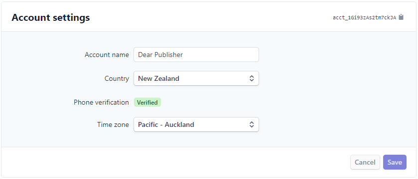

# Getting Started
Subscription Management (SM) is a separate extension which you use as a dependency for each extension you would like to monetise. It uses Stripe as an only beckend. This short manual will guide you through steps required to integrate your app with it.
## 1. Setup Stripe Account
 - First, [create your Stripe account.](https://dashboard.stripe.com/register) SM use publisher's Stripe account as a backend for all data. Publisher's products as well as future customers and subscriptions will be stored and handled in Stripe.

<!-- theme: warning -->
> SM will have full access to your Stripe account data so it's strongly recommended to create separate account just for it.

 - Second, [email us](mailto:volodymyr.leonov@theta.co.nz?subject=%5BSM%5D) your *Stripe Account ID* and links to *Terms of conditions* and *Privacy policy* if available. You can retrieve your *Stripe Account ID* from your [Stripe account details page](https://dashboard.stripe.com/settings/account).

## 2. Setup Stripe Product & Price
<!-- theme: info -->
> This process still to be documented. Please contact [Product Team](mailto:volodymyr.leonov@theta.co.nz?subject=%5BSM%5D) for assistance.
## 3. Setup Dependencies
<!-- theme: info -->
> This process still to be documented. Please contact [Product Team](mailto:volodymyr.leonov@theta.co.nz?subject=%5BSM%5D) for assistance.
## 4. "Hello Integration"
<!-- theme: info -->
> This process still to be documented. Please contact [Product Team](mailto:volodymyr.leonov@theta.co.nz?subject=%5BSM%5D) for assistance.
## 5. Try Me
<!-- theme: info -->
> This process still to be documented. Please contact [Product Team](mailto:volodymyr.leonov@theta.co.nz?subject=%5BSM%5D) for assistance.
