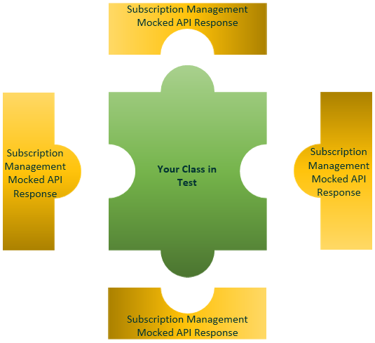

# Mocking
## What is Mocking?

If you look up the noun *mock* in the dictionary you will find that one of the
definitions of the word is *something made as an imitation*.

Mocking is primarily used in unit testing. An object under test may have
dependencies on other (complex) objects. To isolate the behaviour of the object
you want to replace the other objects with mocks that simulate the behaviour of
the real objects. This is useful if the real objects are impractical to
incorporate into the unit test.

In short, mocking is creating objects that simulate the behaviour of real
objects.

Classes are not isolated as they are using services and methods from other
classes, but in unit testing, we want to test methods of one class in isolation.

To do that we mock the services and methods from other classes and simulate the
real behaviour of them using some mocking frameworks and use those mocked
methods and services to do unit testing in isolation.

## What is a Mock API Server?

A mock API server or mock server API imitates a real API server by providing
realistic mock API responses to requests. They can be on your local machine or
the public Internet. Responses can be static or dynamic, and simulate the data
the real API would return, matching the schema with data types, objects, and
arrays.

<!-- theme: info -->
>**Why Use API Mocking?**
>
>A mock API server is useful during development and testing when live data is
either unavailable or unreliable. While designing an API, you can use mock APIs
to work concurrently on the front and back-end, as well as to gather feedback
from developers. Our Subscription Management Mocking API has details how you can use a mock API server so the absence of a real API doesn’t
hold you back.

## Subscription Management Mocking API

Subscription Management has three methods you can call from our Mocking API:

1.  **RequestMocking**

    Request the service to be mocked by utilizing the private key provided.

2.  **AuthorizeMocking**

    Allows further calls to the service to be mocked using provided private key.

3.  **SetMock**

    Sets the response which SubscriptionMgt_SM_TSL will reply with during the
    test execution.

    The SubscriptionMgt_SM_TSL codeunit contains all the code blocks for the
    integration aspect of the Subscription Management app.
    
    
## See Also

-   [Subscription Management Reference
    Document](https://github.com/thetanz/smp-docs/blob/master/docs/References/SubscriptionMgt.md#mocking-api)
