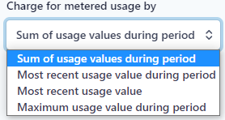
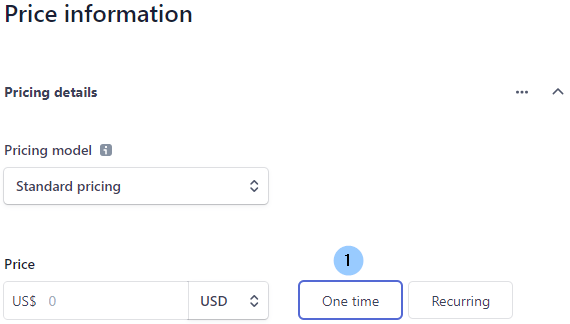
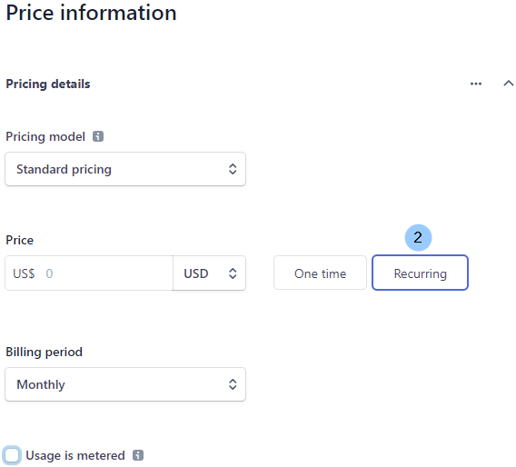
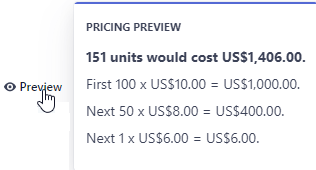

# Product Setup
## Pricing your Product

There are many options for you to explore and consider when pricing your
product. Pricing Models configure how the units of your product are priced, and
Usage Types configure how the units of your product are quantified. It is even
possible to add multiple pricing models, billing periods, and currencies to one
product.

The following sections describe these options in more detail and give guidance
on how to configure and combine the pricing you want.

## Pricing Models

When you are planning the product subscription and depending on
how you want to price each product unit, you can choose between several pricing
models. The pricing models available are **Standard**, **Volume**, **Package**,
and **Graduated**.

Here is a comparison of each pricing model:

| Standard                                                                | Volume                                                                                                                                                                                                                            | Package                                                                                                                                                                                                                    | Graduated                                                                                                                                                                                                                                   |
|-------------------------------------------------------------------------|-----------------------------------------------------------------------------------------------------------------------------------------------------------------------------------------------------------------------------------|----------------------------------------------------------------------------------------------------------------------------------------------------------------------------------------------------------------------------|---------------------------------------------------------------------------------------------------------------------------------------------------------------------------------------------------------------------------------------------|
| Select **Standard** pricing if you charge the same price for each unit. | Select **Volume** pricing if you charge the same for each unit based on the total number of units sold. For example, you might charge 10.00 USD per unit for 50 units, and 7.00 USD per unit when the 50+ units total is reached. | Select **Package** pricing if you charge by a group of units or a package. For example, if you charge 50.00 USD for every 5 units. Purchases are rounded up by default, so a customer buying 8 units would pay 100.00 USD. | Select **Graduated** pricing if you use pricing tiers that may result in a different price for some units in an order. For example, you might charge 10.00 USD per unit for the first 100 units and then 5.00 USD per unit for the next 50. |

## Correlation of Pricing Models to Usage Types

Usage records provide **quantity** information that is used to track how many of
your products a customer is consuming.

With quantity information and the **pricing model** set up by the metered
billing plan, the invoices you send to your customers are accurate i.e. quantity
x price = invoiced amount.

## Licensed and Metered Usage Types

The available subscription options are built on [**Usage
Types**](https://stripe.com/docs/billing/subscriptions/model#licensed-and-metered).
These usage types are **licensed** usage and **metered** usage, and they
determine how much a customer is charged for the recurring purchase of your
products.

If you choose the **licensed** usage option, you are requiring that the quantity
of a product is set when the subscription is created or updated. This means that
for every billing period, the subscription charges the quantity x price for the
product.

With the **metered** usage option your customer is charged for the amount of
your product they have consumed. At the end of the billing period, the total
usage x price is used to calculate how much the customer owes.

When you create a new product, licensed usage is applied by default unless you
select the “**Usage is metered**” checkbox control.

Making this selection then opens a “**Charge for metered usage by**” dropdown
control, where you can select the option that best suits your billing strategy.

<!-- theme: warning -->
>A product has usage categorized as Licensed by default until the
“**Usage is metered**” checkbox control is selected, then the usage changes to
Metered.

## Configure your Product Pricing

The product setup user interface is contextually driven and the options
presented to you directly relate to your previous selections. Here is more
information on configuring each of the pricing options available.

### Standard Pricing

There are two methods of configuring the **standard** pricing model. Option 1 is
for a one-time purchase of your product.

Option 2 is for recurring purchases of your product

You can select the billing period you want, and also choose to meter the usage.

<!-- theme: info -->
>Metered billing lets you charge customers based on reported usage at
the end of each billing period.

### Volume Pricing

With **volume** pricing, the first unit and last unit columns are used to set
prices based on the total number of units sold.

Additional tiers can be added by using the **Add another tier** control.

Hovering over the **Preview** control shows how your selections will impact the
pricing at the final price breakpoint.

As per standard pricing, the billing period can be selected, and also metering
of the product usage.

### Package Pricing

In the same way as standard pricing, there are two methods of configuring the
**package** pricing model. Option 1 is for a one-time purchase of your product,
and Option 2 is for recurring purchases of your product

As per standard pricing, the billing period can be selected, and also metering
of the product usage.

### Graduated Pricing

With **graduated** pricing, the first unit and last unit columns are used to set
a different price for some units in the order.

Additional tiers can be added by using the **Add another tier** control.

Hovering over the **Preview** control shows how your selections will impact the
pricing at the final price breakpoint.

### One Product – Many Options

As you create your products you can add multiple pricing models, billing
periods, and currencies to one product by selecting the **Add another price**
button

Below is a single product with multiple pricing attributes:

1.  a price per unit per month in USD

2.  a volume-based discount for 3 monthly purchases in USD, and

3.  a price per unit per week in EUR

There is no limit to the multiples that can be added to one product. You can
also add or edit the multiples later by accessing the product record on the
Products page of your dashboard and selecting the controls:

1.  **+ Add another price**, or

2.  **…** (the ellipses to open a sub-menu)

