# Pricing
**Subscription Management** (platform), as well as **Stripe** (payment provider), offer pay-as-you-go pricing, based on payments you process. There are no setup fees, monthly fees, or any other hidden fees. Your final price will be calculated as a sum of transaction fees from both parties, based on your app price to your customer, as defined in the table below. 

| | Subscription Mgt. | Stripe
|-|-
Transaction fees | **7%** | **3.4%+30¢** ([region specific](https://stripe.com/pricing))
Both fees will be automatically applied to a transaction amount as the transaction happens. There are no fees if you need to refund a payment, but the fees on the original payment will not be returned in case of a refund.
## Volume Discount
We support our publishers with a volume-based discount program. Publishers that show a significant sale over a year will receive a discount for the platform fee for the next full year as defined in the table below.

| |  | 
-|-
Sales (USD) | > 100,000 USD | > 500,000 USD
Transaction fee | **6% (14% discount)** | **5% (28% discount)**
The anniversary date will be set with the first successful customer payment. If you have achieved one of the thresholds, the discount will then be applied automatically to all future transactions.

Stripe has its own volume-based discount program. Please [contact the Stripe sales team](https://stripe.com/en-nz/contact/sales) to get more information about it.

 
## Non-profit Discount
[Like Stripe](https://support.stripe.com/questions/fee-discount-for-nonprofit-organizations), we would like to support non-profit organizations. Please [contact our product team](mailto:d365support@theta.co.nz?subject=SM%20for%20nonprofit%20discount%20request) with evidence of your non-profit status to get a 100% service discount.

## Open Source Discount
At Theta we are big fans and supporters of Open Source initiatives. In support of the Business Central Open Source community, we are offering a 57% discount, i.e. a transaction fee of 3%, to all publishers which have all apps available as open source. Please [contact our product team](mailto:app.billing@theta.co.nz?subject=SM%20for%20open%20source%20discount%20request) to get a service discount.

## Licensed and Metered Usage

The available subscription options are built on [**Usage
Types**](https://stripe.com/docs/billing/subscriptions/model#licensed-and-metered).
These usage types are **licensed** usage and **metered** usage, and they
determine how much a customer is charged for the recurring purchase of your
products.

If you choose the **licensed** usage option, you are requiring that the quantity
of a product is set when the subscription is created or updated. This means that
for every billing period, the subscription charges the quantity x price for the
product. For example, a customer with three users who subscribes to a 10 USD
per-user monthly service is charged 30 USD every month.

With the **metered** usage option your customer is charged for the amount of
your product they have consumed. At the end of the billing period, the total
usage x price is used to calculate how much the customer owes. For example, if a
broadband provider charges 0.50 USD per gigabyte (GB) used, and a customer uses
100 GBs, the customer is charged 50 USD.

When you create a new product, licensed usage is applied by default unless you
select the “**Usage is metered**” checkbox control.

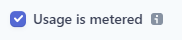

Making this selection then opens a “**Charge for metered usage by**” dropdown
control, where you can select the option that best suits your billing strategy.

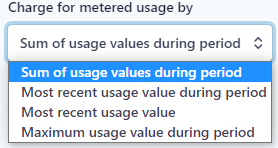

<!-- theme: warning -->
>Important. A product has usage categorized as Licensed by default until the
“**Usage is metered**” checkbox control is selected, then the usage changes to
Metered.

## Pricing Models

When you are planning how to configure the product subscription and depending on
how you want to price each product unit, you can choose between several pricing
models. The pricing models available are **Standard**, **Volume**, **Package**,
and **Graduated**.

Here is a comparison of each pricing model:

| Standard                                                                | Volume                                                                                                                                                                                                                            | Package                                                                                                                                                                                                                     | Graduated                                                                                                                                                                                                                                    |
|-------------------------------------------------------------------------|-----------------------------------------------------------------------------------------------------------------------------------------------------------------------------------------------------------------------------------|-----------------------------------------------------------------------------------------------------------------------------------------------------------------------------------------------------------------------------|----------------------------------------------------------------------------------------------------------------------------------------------------------------------------------------------------------------------------------------------|
| Select **standard** pricing if you charge the same price for each unit. | Select **volume** pricing if you charge the same for each unit based on the total number of units sold. For example, you might charge 10.00 USD per unit for 50 units, and 7.00 USD per unit when the 50+ units total is reached. | Select **package** pricing if you charge by a group of units or a package.  For example, if you charge 50.00 USD for every 5 units. Purchases are rounded up by default, so a customer buying 8 units would pay 100.00 USD. | Select **graduated** pricing if you use pricing tiers that may result in a different price for some units in an order. For example, you might charge 10.00 USD per unit for the first 100 units and then 5.00 USD per unit for the next 50.  |

## How the Usage Types correlate to the Pricing Models

Usage records provide **quantity** information that is used to track how many of
your products a customer is consuming.

With quantity information and the **pricing model** set up by the metered
billing plan, the invoices you send to your customers are accurate i.e. quantity
x price = invoiced amount.

## Configuring the Pricing for your Product

The product setup user interface is contextually driven and the options you are
presented with directly relate to your previous selections. Here is more
information on configuring each of the pricing options available.

### Standard Pricing 

There are two methods of configuring the standard pricing model. Option 1 is for
a one time purchase of your
product.

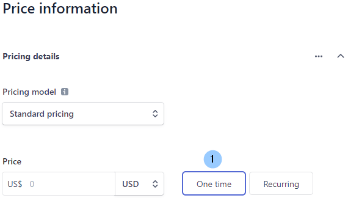

Option 2 is for recurring purchases of your product

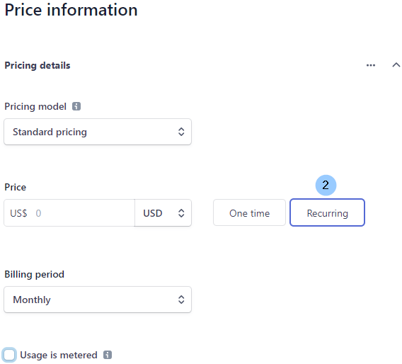

You can select the billing period you want, and also choose whether to meter the
usage.

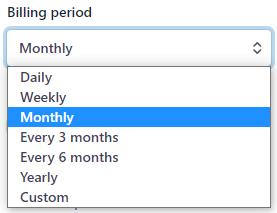

<!-- theme: warning -->
>Remember: metered billing lets you charge customers based on reported usage at
the end of each billing period.

### Volume Pricing

The first unit and last unit columns are used to set prices based on the total
number of units sold. In the example below, the first 150 units are charged at
10.00 USD each, and when the 151 total is achieved, all units are charged at
7.00 USD each.

Additional tiers can be added by using the **Add another tier** control.
Hovering over the **Preview** control shows how your selections will impact the
pricing at the final price breakpoint.

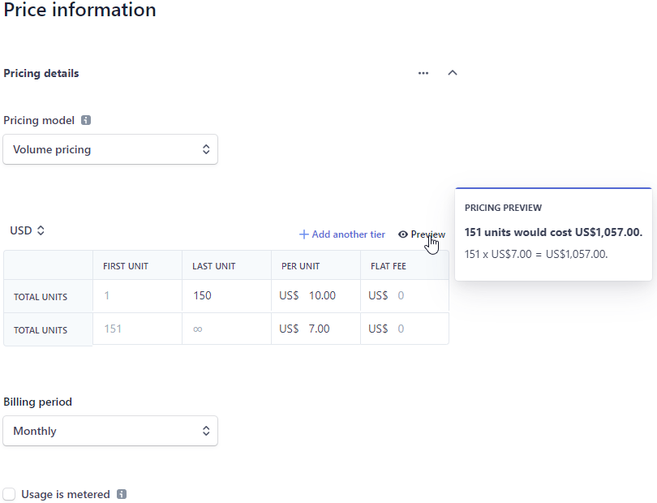

As per Standard pricing, the billing period can be selected, and also metering
of the product usage.

### Package Pricing

There are two methods of configuring the package pricing model. Option 1 is for
a one time purchase of your product.      

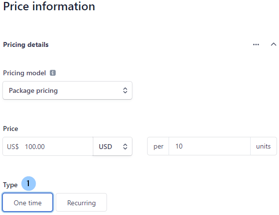

Option 2 is for recurring purchases of your product

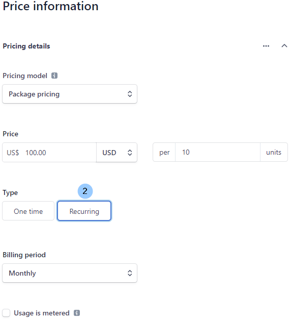

As per Standard pricing, the billing period can be selected, and also metering
of the product usage.

### Graduated Pricing

The first unit and last unit columns are used to set a different price for some
units in the order. In the example below, the first 100 units are charged at
10.00 USD each, the next 50 units are charged at 8.00 USD each, and units over
151 are charged at 6.00 USD each.

Additional tiers can be added by using the **Add another tier** control.
Hovering over the **Preview** control shows how your selections will impact the
pricing at the final price breakpoint.

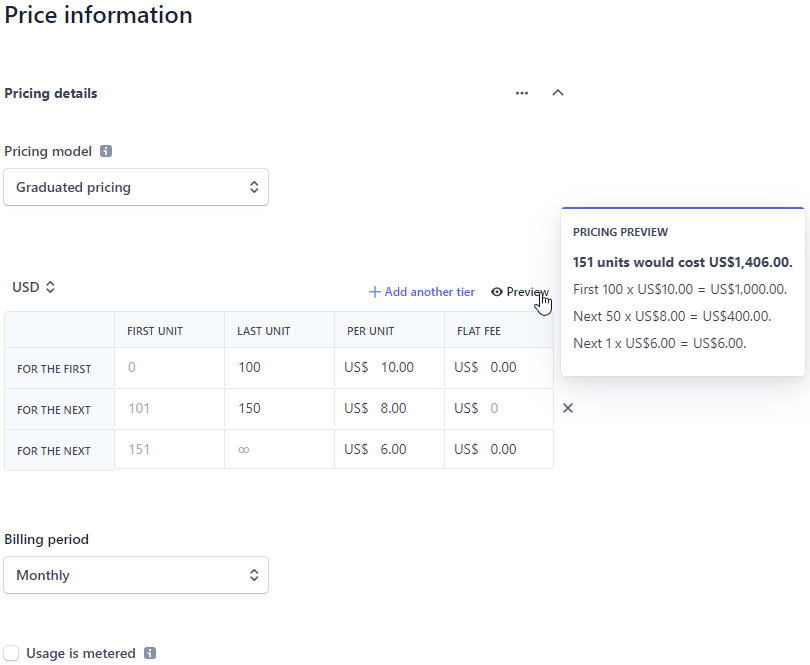

## One Product - Multiple Pricing Models, Billing Periods, & Currencies

As you create your products you can add multiple pricing models, billing periods,
and currencies to one product by selecting the **Add another price** button.

In this example, there is:

1.  a price per unit per month in USD

2.  a volume-based discount for 3 monthly purchases in USD, and

3.  a price per unit per week in EUR

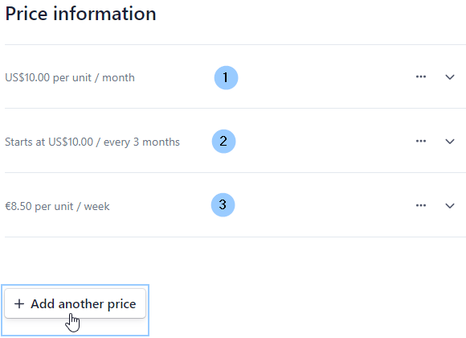

There is no limit to the multiples that can be added to one product, and you can
also add or edit the multiples later by accessing the product record and
selecting the controls:

1.  **+ Add another price**, or

2.  **…** (ellipses to open a sub-menu)

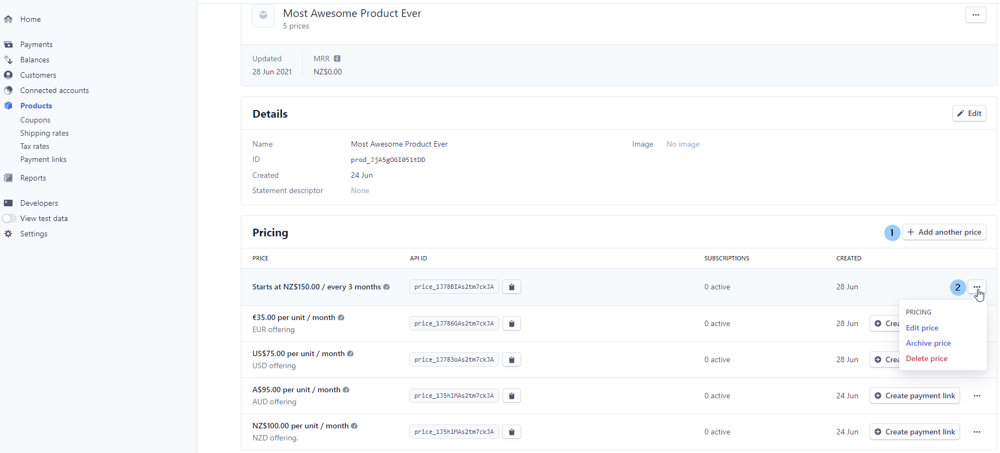

## See Also
- [Getting Started](GettingStarted.md)
- [Security & Privacy](Overview/Security&Privacy.md)
- [FAQ](FAQ.md)
