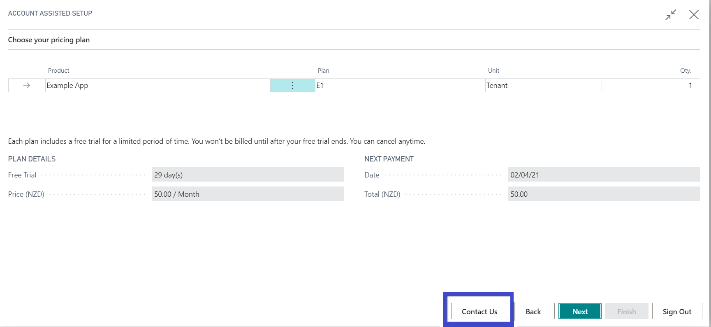
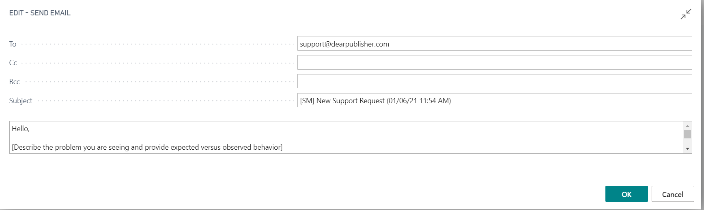
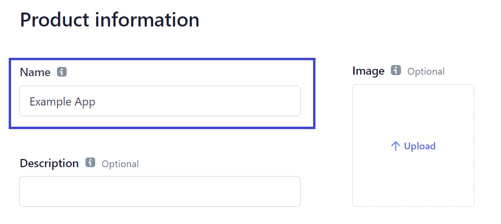
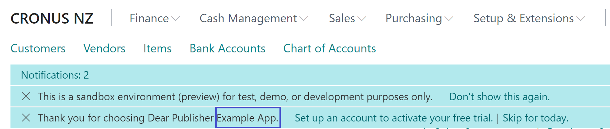
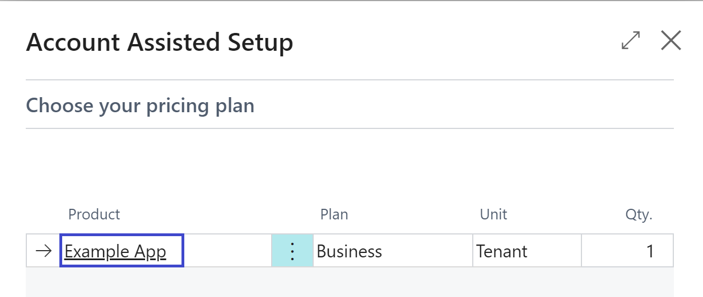
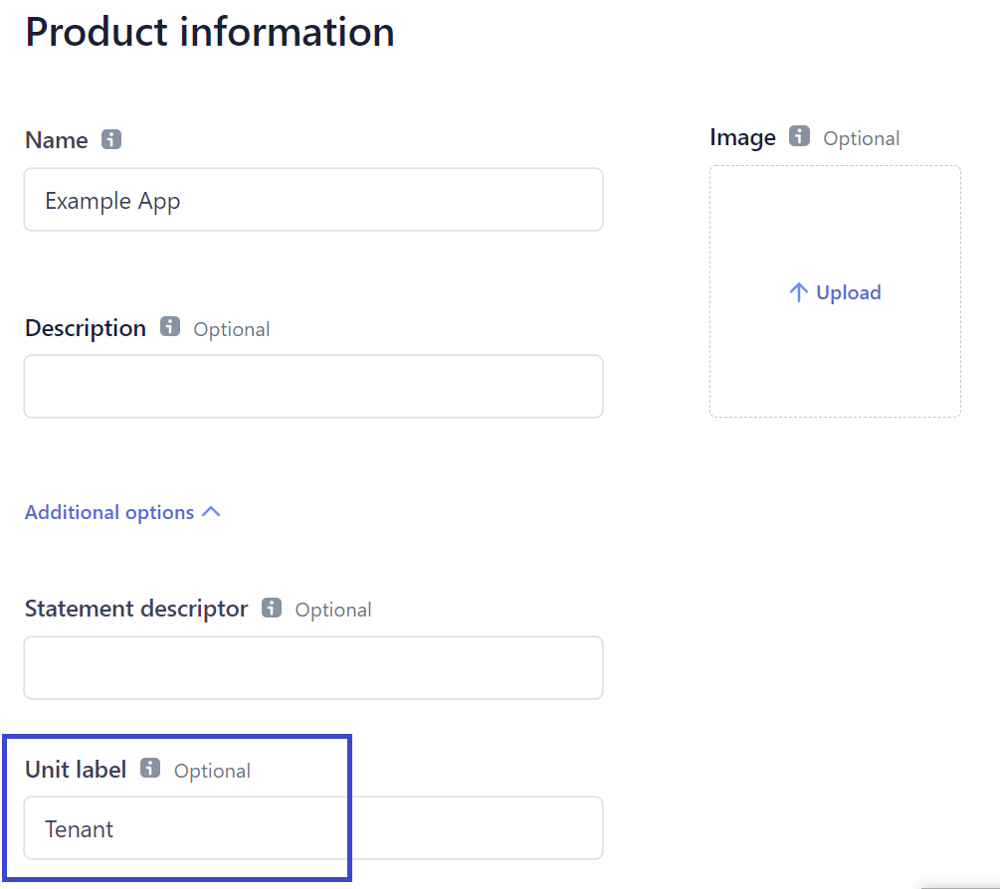
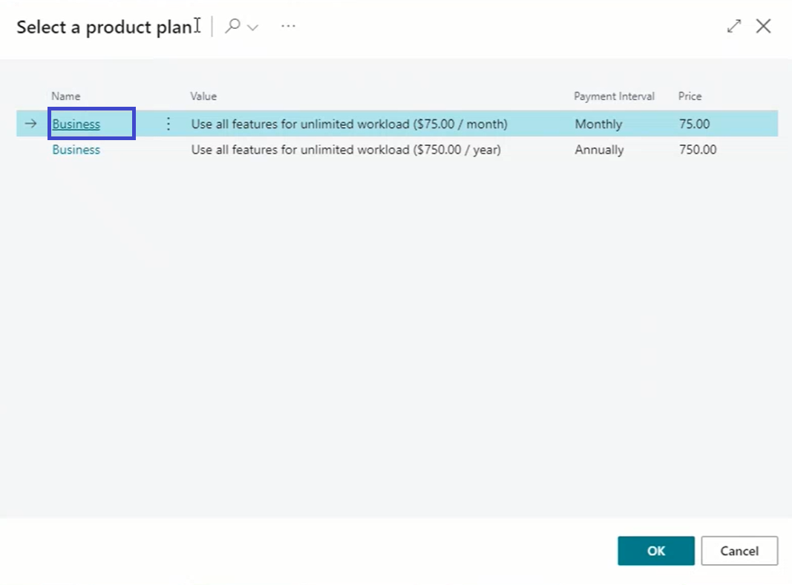
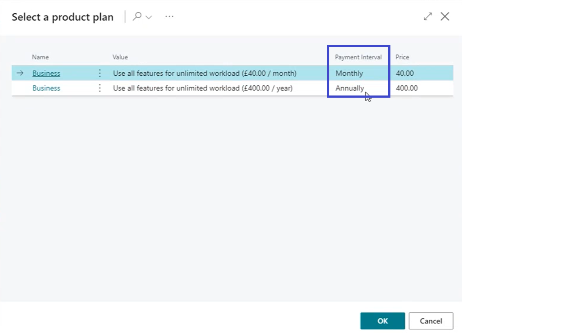

# Stripe Schema
Subscription management uses Stripe to manage different plans and payments processing. Below you will find details of different entities of Stripe that have been utilized and integrated within Subscription Management.
## Account
### Name
Customer gets to see this name as publisher name throughout BC. Preferably Name should be similar to your AppSource publisher name.
#### Setup in Stripe UI
1. Go to [Stripe account details](https://dashboard.stripe.com/settings/account)
2. Fill-in Account name under account settings section and save.

#### Where used in SM
It's used in multiple places through assisted setup and notifications.
### Support Email
This email will be used by customers for contacting the publisher. 
#### Setup in Stripe UI
1. Go to [Stripe account details](https://dashboard.stripe.com/settings/account)
2. Fill-in support email under "Pubic business information" section and save.

#### Where used in SM
Available as "Contact Us" button on all the sign-up "Assisted Setup" pages. 

## Product
### ID
Unique identifier for the product in Stripe. Automatically generated by Stripe when a new product is added.
#### Setup in Stripe UI
Go to products list page and click on desired product to view ID.

#### Where used in SM
Used by "Subscription Management" to uniquely identify the product in Stripe during API calls.
### Name
"Name" represents the name of the publisher's app in Stripe and in BC. Subscription management uses this "Name" to refer to the publisher's app.
#### Setup in Stripe UI
1. Go to Stripe dashboard and products section then click on "Add products"

2. Fill-in Account name under account settings section and save.

#### Where used in SM
It's used in multiple places through assisted setup and notifications to identify the App.

### Unit
Unit of measure for your product. Defines how you sell your product. e.g. (per) tenant, user or usage etc.
#### Setup in Stripe UI
Under "Product information" and "Additional options" section

#### Where used in SM
Its used on the assisted setup page.

## Price
### Name
Unique identifier for the Price in Stripe.
#### Setup in Stripe UI
Defined as "Price Description" when setting up a new price in Stripe.

#### Where used in SM
Equivalent to Plan in Assisted Setup

### Description
A brief information about the product. 
#### Setup in Stripe UI
Setup from "Edit metadata" action from "Product" details page. Default metadata for Description is "description" (lower case). Multiple languages are supported. Please suffix "description" with _LocaleCode for other languages.

#### Where used in SM
Reflects under Value field on "Assisted Setup", "Select a product plan" step. 

### Currency
Represents currency associated to the price plan. Currently "Subscription Management" supports NZD, USD, AUD, GBP and EUR currencies.
#### Setup in Stripe UI
Defined as "Currency" when setting up a new price in Stripe.

#### Where used in SM
When signing up for the "Subscription Management", user is provided with a list of currencies that are supported. User needs to select a currency from list of supported currencies and then the selected currency is used to filter plans as per matching 'currency code" from account information.

### Billing Period
Represents length of time between two billing cycle. Currently "Subscription Management" supports "Monthly" and "Yearly". We will be happy to support more as per publisher request.
#### Setup in Stripe UI
Defined as "Billing Period" when setting up a new price in Stripe.

#### Where used in SM
It appears on "Select a product plan" as "Payment Interval" during sign-up process.

### Trial Period
Specifies the free number of days a customer have. AppSource requires a minimum of 30 days of trial period. Subscription management maintains remaining trial period days for the customer. It starts notifying 7 days, 3 days and 1 day before the trial expires and asks for payment method details. If payment method details are not entered before trial period has expired then subscription is marked as "Passed due" and subscription will not be active.
#### Setup in Stripe UI
Defined as "Trial period" when setting up a new price in Stripe.

#### Where used in SM
Used to track "Plan Details" and "Next Payment" details.

## Tax Rate
Defines how customers from different regions should be taxed.
### Region
"Subscription Management" checks the tax rates you have defined in Stripe for different regions; and then compares it with the region of the customer during sign-up process.
#### Setup in Stripe UI
Setup under Tax rates section.

#### Where used in SM
If a tax rate exists for the customer's region then he must provide his "Tax Registration No." during sign-up and is charged tax accordingly.

## See Also
- [SubscriptionMgt_SM_TSL Reference](SubscriptionMgt.md)
- [Stripe Lifecycle](StripeLifecycle.md)