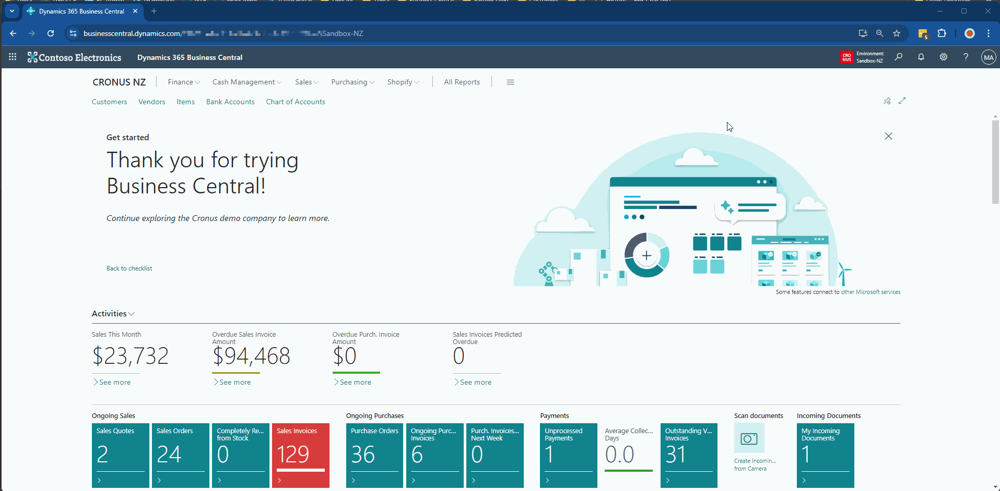

# Important Update Needed

`8 August 2024`

We have received reports from several customers who have experienced subscription issues with some of our apps. These customers had active subscriptions, but **were prevented from using the app**. We have identified the cause and released a fix. To avoid being impacted by this issue, it is important that you or your partner **update the "Subscription Management for Publishers" app in your Production environment**.

While the process only takes a few minutes, we recommend updating the app outside office hours to avoid disrupting your users. Please follow this link for detailed steps on how to update the app. The steps you need to follow are:
1.	Open the Admin Center. You can do this from within any environment by selecting Settings, Admin Center.
2.	Select the Production environment
3.	Select Apps
4.	Scroll down to the "Subscription Management for Publishers" app.
5.	Select "Install Update". You will notice that this will also trigger an update to the SubscriptionMgt extension. 
6.	Select “Update to the latest”. Note: You will be asked to confirm that you have read and understand our [terms of use](https://thetacdn.blob.core.windows.net/assets/Legal%20docs/Theta%20Extensions%20Appsource%20Terms%20and%20Conditions) and [privacy policy](https://www.theta.co.nz/privacy-policy).

**Note: You do not need to perform this update if version 1.4.10.0 or higher is installed.**

The animation below shows you the steps described above. [Please reach out to us if you require any further assistance.](mailto:hello.d365@theta.co.nz?subject=Subscription%20Management%20Assistance%20Required)

